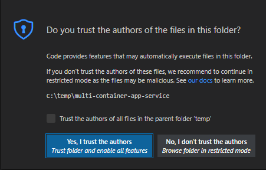
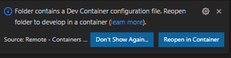
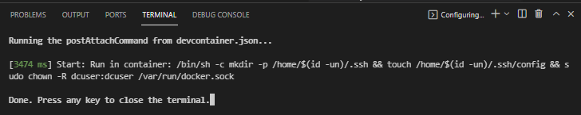
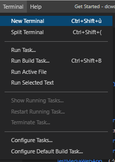
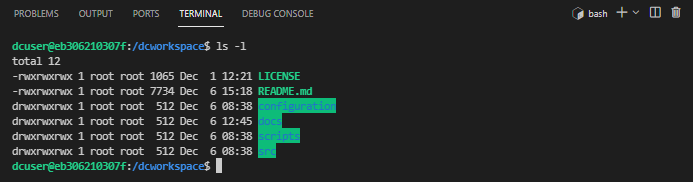
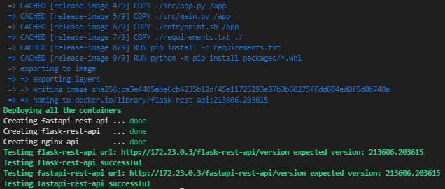
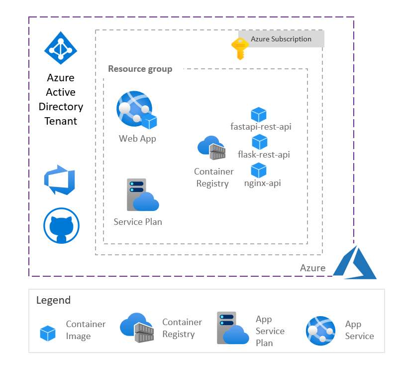
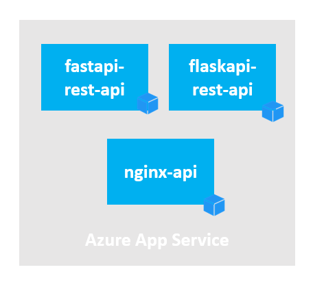
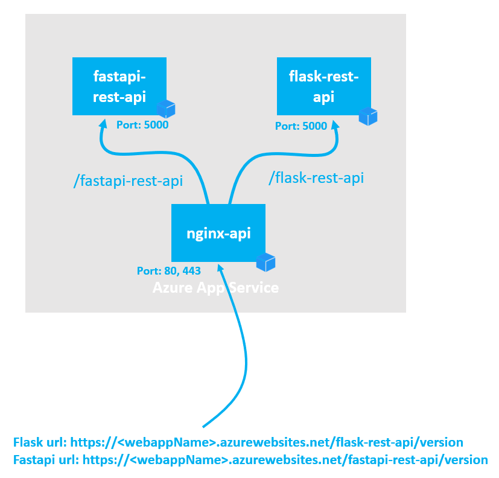

# Multi-Container hosting REST API Services behind an NGINX frontend
# Table of Contents
- [Multi-Container hosting REST API Services behind an NGINX frontend](#multi-container-hosting-rest-api-services-behind-an-nginx-frontend)
- [Table of Contents](#table-of-contents)
  - [Introduction](#introduction)
  - [Installing the pre-requisites](#installing-the-pre-requisites)
    - [Installing Git](#installing-git)
    - [Installing Docker and Visual Studio Code](#installing-docker-and-visual-studio-code)
  - [Installing the project](#installing-the-project)
    - [Clone the repository](#clone-the-repository)
    - [Launch Visual Studio Code with the dev container](#launch-visual-studio-code-with-the-dev-container)
  - [Running the REST APIs locally](#running-the-rest-apis-locally)
    - [Testing locally flask REST API](#testing-locally-flask-rest-api)
    - [Testing locally fastapi REST API](#testing-locally-fastapi-rest-api)
  - [Running the REST APIs in a local container](#running-the-rest-apis-in-a-local-container)
    - [Testing flask REST API in a local container](#testing-flask-rest-api-in-a-local-container)
    - [Testing fastapi REST API in a local container](#testing-fastapi-rest-api-in-a-local-container)
    - [Testing fastapi REST API container and flask REST API container behind nginx](#testing-fastapi-rest-api-container-and-flask-rest-api-container-behind-nginx)
  - [Running the REST APIs in Azure](#running-the-rest-apis-in-azure)
    - [Deploying the infrastructure](#deploying-the-infrastructure)
    - [Building the container images](#building-the-container-images)
    - [Testing the REST APIs](#testing-the-rest-apis)
  - [Next steps](#next-steps)

Azure App Services are now supporting multi-containers deployment on the same Azure App Service. This new feature allow partners and customers to optimize the cost of a multi-services deployment using one single Azure App Service instead of several Azure App Services. This sample show how to deploy several containers hosting REST APIs behind a container running nginx.

## Introduction

This sample will show how to deploy 2 python based REST APIs based on FastAPI and Flask behind a NGINX frontend running in the same Azure App Service.

Deploying several REST API on the same Azure App Service using multi-containers approach allow Azure's users to optimize their infrastructure cost. Moreover this approach provides more granularirty when a REST API will be updated, only one single container hosting the REST API will  be updated, the other containers won't be impacted with this update.

Each REST API service and the NGINX frontend will be defined with a Dockerfile. All the services will be deployed to the Azure App Service using a docker-compose yaml file.  

## Installing the pre-requisites

In order to deploy and test this solution we recommend to use Docker, Visual Studio Code with a dev container.
This chapter describes how to install Git, Docker and Visual Studio Code on Windows, MacOS and Linux.

### Installing Git

Git client will be required to clone the repository on your local machine. Git client can installed on Windows, MacOS, Linux.

[Installing Git on several platform](https://git-scm.com/book/en/v2/Getting-Started-Installing-Git)
### Installing Docker and Visual Studio Code

|[](https://www.docker.com/products/docker-desktop)|[](https://docs.docker.com/get-docker/)|[](https://www.docker.com/products/docker-desktop)|
| :--- | :--- | :--- |
| [Docker Desktop](https://www.docker.com/products/docker-desktop) 2.0+ on Windows 10 Pro/Enterprise. Windows 10 Home (2004+) requires Docker Desktop 2.3+ and the [WSL 2 back-end](https://docs.docker.com/desktop/windows/wsl/). (Docker Toolbox is not supported. Windows container images are not supported.) <br />[Visual Studio Code](https://code.visualstudio.com/docs/setup/windows)|  [Docker CE/EE](https://docs.docker.com/get-docker/) 18.06+ and [Docker Compose](https://docs.docker.com/compose/install/) 1.21+. (The Ubuntu snap package is not supported.) <br />[Visual Studio Code](https://code.visualstudio.com/docs/setup/linux) &nbsp;&nbsp; &nbsp;&nbsp; &nbsp;&nbsp; &nbsp;&nbsp; &nbsp;&nbsp; &nbsp;&nbsp; &nbsp;&nbsp; &nbsp;&nbsp; &nbsp;&nbsp; &nbsp;&nbsp; &nbsp;&nbsp; &nbsp;&nbsp; &nbsp;&nbsp; &nbsp;&nbsp; &nbsp;&nbsp; &nbsp;&nbsp; &nbsp;&nbsp; &nbsp;&nbsp; &nbsp;&nbsp; &nbsp;&nbsp; &nbsp;&nbsp; &nbsp;&nbsp; &nbsp; &nbsp;&nbsp; &nbsp;&nbsp; &nbsp;&nbsp; &nbsp;&nbsp; &nbsp;&nbsp; &nbsp;&nbsp; &nbsp;&nbsp; &nbsp;&nbsp; &nbsp;&nbsp; &nbsp;&nbsp; &nbsp;&nbsp; &nbsp;&nbsp; &nbsp;&nbsp; &nbsp;&nbsp; &nbsp;&nbsp; &nbsp;&nbsp; &nbsp;&nbsp; &nbsp;&nbsp; &nbsp;&nbsp; &nbsp;&nbsp; &nbsp;&nbsp; &nbsp;&nbsp; &nbsp;&nbsp; &nbsp;&nbsp; &nbsp;&nbsp; &nbsp;&nbsp; &nbsp;&nbsp; &nbsp;&nbsp; &nbsp;&nbsp; &nbsp;&nbsp; &nbsp;&nbsp; &nbsp;&nbsp; &nbsp;&nbsp; &nbsp;&nbsp; &nbsp;&nbsp; &nbsp;&nbsp; &nbsp;&nbsp; &nbsp; &nbsp;&nbsp; &nbsp;&nbsp; &nbsp;&nbsp; &nbsp;&nbsp; &nbsp;&nbsp; &nbsp;&nbsp; &nbsp;&nbsp; &nbsp;&nbsp; &nbsp;&nbsp; &nbsp;&nbsp; &nbsp;&nbsp; &nbsp;&nbsp; &nbsp;&nbsp; &nbsp;&nbsp; &nbsp;&nbsp; &nbsp;&nbsp; &nbsp;&nbsp; &nbsp;&nbsp; &nbsp;&nbsp; &nbsp;&nbsp; &nbsp;&nbsp; &nbsp;&nbsp; &nbsp;&nbsp; &nbsp;&nbsp; &nbsp;&nbsp; &nbsp;&nbsp; &nbsp;&nbsp; &nbsp;&nbsp; &nbsp;&nbsp; &nbsp;&nbsp; &nbsp;&nbsp; &nbsp;&nbsp; &nbsp;&nbsp; &nbsp;&nbsp; &nbsp;&nbsp; &nbsp;&nbsp; &nbsp;&nbsp; &nbsp; &nbsp;&nbsp; &nbsp;&nbsp; &nbsp;&nbsp; &nbsp;&nbsp; &nbsp;&nbsp; &nbsp;&nbsp; &nbsp;&nbsp; &nbsp;&nbsp; &nbsp;&nbsp; &nbsp;&nbsp; &nbsp;&nbsp; &nbsp;&nbsp; &nbsp;&nbsp; &nbsp;&nbsp; &nbsp;&nbsp; &nbsp;&nbsp; &nbsp;&nbsp; &nbsp;&nbsp; &nbsp;&nbsp; &nbsp;&nbsp; &nbsp;&nbsp; &nbsp;&nbsp; &nbsp;&nbsp;    | [Docker Desktop](https://www.docker.com/products/docker-desktop) 2.0+. <br />[Visual Studio Code](https://code.visualstudio.com/docs/setup/mac) &nbsp;&nbsp; &nbsp;&nbsp; &nbsp;&nbsp; &nbsp;&nbsp; &nbsp;&nbsp; &nbsp;&nbsp; &nbsp;&nbsp; &nbsp;&nbsp; &nbsp;&nbsp; &nbsp;&nbsp; &nbsp;&nbsp; &nbsp;&nbsp; &nbsp;&nbsp; &nbsp;&nbsp; &nbsp;&nbsp; &nbsp;&nbsp; &nbsp;&nbsp; &nbsp;&nbsp; &nbsp;&nbsp; &nbsp;&nbsp; &nbsp;&nbsp; &nbsp;&nbsp; &nbsp; &nbsp;&nbsp; &nbsp;&nbsp; &nbsp;&nbsp; &nbsp;&nbsp; &nbsp;&nbsp; &nbsp;&nbsp; &nbsp;&nbsp; &nbsp;&nbsp; &nbsp;&nbsp; &nbsp;&nbsp; &nbsp;&nbsp; &nbsp;&nbsp; &nbsp;&nbsp; &nbsp;&nbsp; &nbsp;&nbsp; &nbsp;&nbsp; &nbsp;&nbsp; &nbsp;&nbsp; &nbsp;&nbsp; &nbsp;&nbsp; &nbsp;&nbsp; &nbsp;&nbsp; &nbsp;&nbsp; &nbsp;&nbsp; &nbsp;&nbsp; &nbsp;&nbsp; &nbsp;&nbsp; &nbsp;&nbsp; &nbsp;&nbsp; &nbsp;&nbsp; &nbsp;&nbsp; &nbsp;&nbsp; &nbsp;&nbsp; &nbsp;&nbsp; &nbsp;&nbsp; &nbsp;&nbsp; &nbsp;&nbsp; &nbsp; &nbsp;&nbsp; &nbsp;&nbsp; &nbsp;&nbsp; &nbsp;&nbsp; &nbsp;&nbsp; &nbsp;&nbsp; &nbsp;&nbsp; &nbsp;&nbsp; &nbsp;&nbsp; &nbsp;&nbsp; &nbsp;&nbsp; &nbsp;&nbsp; &nbsp;&nbsp; &nbsp;&nbsp; &nbsp;&nbsp; &nbsp;&nbsp; &nbsp;&nbsp; &nbsp;&nbsp; &nbsp;&nbsp; &nbsp;&nbsp; &nbsp;&nbsp; &nbsp;&nbsp; &nbsp;&nbsp; &nbsp;&nbsp; &nbsp;&nbsp; &nbsp;&nbsp; &nbsp;&nbsp; &nbsp;&nbsp; &nbsp;&nbsp; &nbsp;&nbsp; &nbsp;&nbsp; &nbsp;&nbsp; &nbsp;&nbsp; &nbsp;&nbsp; &nbsp;&nbsp; &nbsp;&nbsp; &nbsp;&nbsp; &nbsp; &nbsp;&nbsp; &nbsp;&nbsp; &nbsp;&nbsp; &nbsp;&nbsp; &nbsp;&nbsp; &nbsp;&nbsp; &nbsp;&nbsp; &nbsp;&nbsp; &nbsp;&nbsp; &nbsp;&nbsp; &nbsp;&nbsp; &nbsp;&nbsp; &nbsp;&nbsp; &nbsp;&nbsp; &nbsp;&nbsp;  |

## Installing the project

### Clone the repository


For you local machine running Windows or MacOS or Linux, open a Terminal and run the following command. 

1. Create a directory to copy the repository

   mkdir myproject

   cd myproject

2. Clone the repository

    git clone https://CSECodeHub@dev.azure.com/CSECodeHub/409271%20-%20Bertelsmann%20-%20Global%20Data%20Platform/_git/multi-container-app-service

### Launch Visual Studio Code with the dev container

1. In the same terminal, navigate to the project folder

    cd /multi-container-app-service

2. Launch Visual Studio Code from your terminal with the following command:

    code .

3. A first dialog box will appear asking the question "Do you trust the authors of the files in this folder?", click on the Yes button.

    

4. A second dialog box will appear asking whether you want to open the project with a dev container. Click on the button "reopen in container"

    

5. Visual Studio Code will build the dev container. After few minutes, the dev container has been built, you you can open a shell running on this dev container

    

6. Select the sub menu "New Terminal" in the menu "Terminal".

    

7. Select the sub menu "New Terminal" in the menu "Terminal". The Terminal appears, and you can use linux shell commands like "ls -l"

    

8. You are now ready to run:
   - locally the REST APIs,
   - in a local docker container the REST APIs,
   - in docker containers in Azure App Services the REST APIs  
  The Dev Container is configured to support the following tools:
   - Azure CLI
   - Docker CLI
   - docker-compose
   - python/pip
   - fastapi
   - flask

## Running the REST APIs locally

Once the dev container is ready you can run locally in the dev container the sample REST APIs based on fastapi and on flask.
Those 2 REST APIs support 2 methods:

- HTTP GET /version to return the current version of the service
- HTTP GET /time to return the current local time

For those 2 services, the version is defined with the envrionment variable APP_VERSION and the HTTP port associated with the service is defined with the envrionment variable PORT_HTTP (7000 by default).

### Testing locally flask REST API

Using the dev container shell run the following command:

1. Change directory:

   cd ./src/flask-rest-api

2. Launch the REST API from the dev container

    chmod +x ./run-local.sh
    ./run-local.sh

3. The REST API is now running locally, and you can check if the service is functionning opening the following url with your favorite browser.

   - This url http://127.0.0.1:7000/version will return the version of this service
   - This url http://127.0.0.1:7000/time will return the current time

### Testing locally fastapi REST API

Using the dev container shell run the following command:

1. Change directory:

   cd ./src/fastapi-rest-api

2. Launch the REST API from the dev container

    chmod +x ./run-local.sh
    ./run-local.sh

3. The REST API is now running locally, and you can check if the service is functionning opening the following url with your favorite browser.

   - This url http://127.0.0.1:7000/version will return the version of this service
   - This url http://127.0.0.1:7000/time will return the current time

## Running the REST APIs in a local container

### Testing flask REST API in a local container

Using the dev container shell run the following command:

1. Change directory:

   cd ./src/flask-rest-api

2. Build the local container and launch the same container hosting the REST API

    chmod +x ./run-docker-local.sh
    ./run-docker-local.sh

3. The REST API is now running locally in a container, and you can check if the service is functionning opening the following url with your favorite browser.

   - This url http://127.0.0.1:5000/version will return the version of this service
   - This url http://127.0.0.1:5000/time will return the current time

If you don't use the container hosting the RET API, don't forget to stop the container using the following command:

    docker stop <containerID>

You can get the containerID using the command:

    docker ps

### Testing fastapi REST API in a local container

Using the dev container shell run the following command:

1. Change directory:

   cd ./src/fastapi-rest-api

2. Build the local container and launch the same container hosting the REST API

    chmod +x ./run-docker-local.sh
    ./run-docker-local.sh

3. The REST API is now running locally, and you can check if the service is functionning opening the following url with your favorite browser.

   - This url http://127.0.0.1:5000/version will return the version of this service
   - This url http://127.0.0.1:5000/time will return the current time

### Testing fastapi REST API container and flask REST API container behind nginx

The 2 REST APIs have been tested running on a local container. We can new test the same REST APIs behind nginx using the following commands from the dev container.

1. Navigate to directory ./scripts

    cd ./scripts

2. Run bash file local-test.sh

    chmod +x ./local-test.sh
    ./local-test.sh

  This bash file creates nginx, fastapi and flask container images. Then it deploys all the containers.
  Once all the containers are deployed, it will test the flask and fastapi urls with a curl command.

  fastapi url: http://{nginx-ip}/fastapi-rest-api/version  
  flask url: http://{nginx-ip}/flask-rest-api/version  
  
  The {nginx-ip} value is the local ip address of the nginx container from the dev container network.
  You can test the same url from your browser using ip address 127.0.0.1 instead of {nginx-ip}. 

  fastapi url: http://127.0.0.1/fastapi-rest-api/version  
  flask url: http://127.0.0.1/flask-rest-api/version  

  Then it stops all the containers.

  

## Running the REST APIs in Azure

When the 3 containers nginx, flask and fastapi are running locally. We can test the same containers in an Azure App Service.
The bash file azure-test.sh will :
- deploy the Azure Infrastructure
- build the container images
- deploy the container images
- test the fasapi and flask urls
- stop the services
- undeploy the infrastructure.

Before running this bash file, you need to define the following environment variables:
- AZURE_SUBSCRIPTION_ID: the Azure Subscription where the infrastructure will be deployed
- AZURE_TENANT_ID: the Azure Tenant Id
- AZURE_REGION: the Azure Region where you will deploy the infrastructure

You can edit the file ./configuration/.default.env and add those variables:

        AZURE_SUBSCRIPTION_ID="yyyyyyyy-yyyy-yyyy-yyyy-yyyyyyyyyyyy"
        AZURE_TENANT_ID="xxxxxxxx-xxxx-xxxx-xxxx-xxxxxxxxxxxx"
        AZURE_REGION="eastus2"

Now you can run the script.

1. Navigate to directory ./scripts

    cd ./scripts

2. Run bash file azure-test.sh

    chmod +x ./azure-test.sh
    ./azure-test.sh

### Deploying the infrastructure

The bash file will deploy first the following infrastructure:
- Azure Container Registry
- Azure Service Plan
- Azure App Service


 

The infrastructure is deployed using an ARM Template:

```json

    {
    "$schema": "https://schema.management.azure.com/schemas/2019-04-01/deploymentTemplate.json#",
    "contentVersion": "1.0.0.0",
    "parameters": {
        "webAppName": {
        "type": "string",
        "defaultValue": "[concat('webapp', uniqueString(resourceGroup().id))]",
        "minLength": 2,
        "metadata": {
            "description": "Web app name."
        }
        },
        "location": {
        "type": "string",
        "defaultValue": "[resourceGroup().location]",
        "metadata": {
            "description": "Location for all resources."
        }
        },
        "sku": {
        "type": "string",
        "defaultValue": "B1",
        "metadata": {
            "description": "The SKU of App Service Plan."
        }
        }
    },
    "variables": {
        "appServicePlanName": "[concat('AppServicePlan-', parameters('webAppName'))]",
        "containerRegistryName": "[concat('acr', parameters('webAppName'))]"
    },
    "resources": [
        {
        "type": "Microsoft.Web/serverfarms",
        "apiVersion": "2020-06-01",
        "name": "[variables('appServicePlanName')]",
        "location": "[parameters('location')]",
        "sku": {
            "name": "[parameters('sku')]"
        },
        "kind": "linux",
        "properties": {
            "reserved": true
        }
        },
        {
        "type": "Microsoft.Web/sites",
        "apiVersion": "2020-06-01",
        "name": "[parameters('webAppName')]",
        "location": "[parameters('location')]",
        "kind": "app,linux,container",
        "dependsOn": [
            "[resourceId('Microsoft.Web/serverfarms', variables('appServicePlanName'))]"
        ],
        "properties": {
            "serverFarmId": "[resourceId('Microsoft.Web/serverfarms', variables('appServicePlanName'))]"
        }
        },
        {
        "type": "Microsoft.ContainerRegistry/registries",
        "apiVersion": "2017-10-01",
        "name": "[variables('containerRegistryName')]",
        "location": "[resourceGroup().location]",
        "sku": {
            "name": "Standard",
            "tier": "Standard"
        },
        "properties": {
            "adminUserEnabled": false
        }
        }
    ],
    "outputs": {
        "acrLoginServer": {
        "type": "string",
        "value": "[reference(resourceId('Microsoft.ContainerRegistry/registries',variables('containerRegistryName')),'2017-10-01').loginServer]"
        },    
        "webAppServer": {
        "type": "string",
        "value": "[concat(parameters('webAppName'),'.azurewebsites.net')]"
        },
        "acrName": {
        "type": "string",
        "value": "[variables('containerRegistryName')]"
        }        
    }
    }

```

Once the ARM template is deployed, it will return the Azure Container Registry Name, the Azure Container Registry Login Server DNS name, the Web App DNS Name.

### Building the container images

Once the infrastructure is deployed, the container images are built using the different Dockerfiles.



The following bash function build the container:

```bash
    function buildWebAppContainer() {
        ContainerRegistryName="$1"
        apiModule="$2"
        imageName="$3"
        imageTag="$4"
        imageLatestTag="$5"
        portHttp="$6"

        targetDirectory="$(dirname "${BASH_SOURCE[0]}")/../$apiModule"

        if [ ! -d "$targetDirectory" ]; then
                echo "Directory '$targetDirectory' does not exist."
                exit 1
        fi

        echo "Building and uploading the docker image for '$apiModule'"

        # Navigate to API module folder
        pushd "$targetDirectory" > /dev/null

        # Build the image
        echo "Building the docker image for '$imageName:$imageTag'"
        cmd="az acr build --registry $ContainerRegistryName --image ${imageName}:${imageTag} --image ${imageName}:${imageLatestTag} -f Dockerfile --build-arg APP_VERSION=${imageTag} --build-arg ARG_PORT_HTTP=${portHttp} . --output none"
        printProgress "$cmd"
        eval "$cmd"
        
        popd > /dev/null
    }
```

Then it deploy all the containers using the following docker-compose template file where {ContainerRegistryUrl} will be replaced with the Azure Container Registry login server DNS name and {APP_VERSION} replaced with the container version:

```yaml

    version: "3"
    services:
    nginx:
        container_name: nginx-api
        image: {ContainerRegistryUrl}nginx-api:latest
        ports:
        - 80:80
        - 443:443
        depends_on:
        - fastapi-rest-api
        - flask-rest-api
    fastapi-rest-api:
        container_name: fastapi-rest-api
        # Remove the build command for configuration file in azure web app service
        image: {ContainerRegistryUrl}fastapi-rest-api:latest
        environment:
        - APP_VERSION={APP_VERSION}      
        ports:
        - 8080:5000
    flask-rest-api:
        container_name: flask-rest-api
        image: {ContainerRegistryUrl}flask-rest-api:latest
        environment:
        - APP_VERSION={APP_VERSION}      
        ports:
        - 8181:5000
```

Moreover, the file ./src/nginx/nginx.conf defines the different location for each REST API.

All the http requests to an url starting with http://{appservicename}.azurewebsites.net/fastapi-rest-api/ will be forwarded to fastapi container.
All the http requests to an url starting with http://{appservicename}.azurewebsites.net/flask-rest-api/ will be forwarded to flask container.

```json
    events {
        worker_connections 1024;
    }
    http {
        server {
            listen 80;
            listen 443;
            server_name _;

            location /fastapi-rest-api/ {
                proxy_pass http://fastapi-rest-api:5000/;
            }

            location /flask-rest-api/ {
                proxy_pass http://flask-rest-api:5000/;
            }
        }
    }
```




Then the bash function deployMultiContainer below will deploy the container.

Note:  
The authentication with Azure Container Registry will be based on login/password which will be stored in the following environment variables:

- DOCKER_REGISTRY_SERVER_URL: the url of the Azure container Registry
- DOCKER_REGISTRY_SERVER_USERNAME: the login
- DOCKER_REGISTRY_SERVER_PASSWORD: the password

```bash
    function deployMultiContainer(){
        prefix="$1"
        ContainerRegistryUrl="$2"
        ContainerRegistryLogin="$3"
        ContainerRegistryPassword="$4"
        
        resourcegroup="${prefix}rg"
        webapp="${prefix}webapp"
        # delete containers
        cmd="az webapp config container delete --name $webapp --resource-group $resourcegroup --output none"
        printProgress "$cmd"
        eval "$cmd"

        printProgress "Create Containers"
        tmp_dir=$(mktemp -d -t mc-XXXXXXXXXX)
        sed "s/{ContainerRegistryUrl}/${ContainerRegistryUrl}\//g"  < $SCRIPTS_DIRECTORY/../src/nginx/docker-compose.template.yml | sed "s/{APP_VERSION}/${APP_VERSION}/g" >  $tmp_dir/docker-compose-app-service.yml
        cmd="az webapp config container set --resource-group  "$resourcegroup" --name "$webapp" \
                --multicontainer-config-type compose --multicontainer-config-file $tmp_dir/docker-compose-app-service.yml --output none"
        printProgress "$cmd"
        eval "$cmd"

        printProgress "Create Config"
        cmd="az webapp config appsettings set -g "$resourcegroup" -n "$webapp" \
        --settings DOCKER_REGISTRY_SERVER_URL="$ContainerRegistryUrl" \
        DOCKER_REGISTRY_SERVER_USERNAME="$ContainerRegistryLogin" \
        DOCKER_REGISTRY_SERVER_PASSWORD="$ContainerRegistryPassword" --output none"
        printProgress "$cmd"
        eval "$cmd"

        printProgress "Restart WebApp"
        cmd="az webapp restart --name $webapp --resource-group $resourcegroup --output none"
        printProgress "$cmd"
        eval "$cmd"

    }
```

### Testing the REST APIs

Once all the containers are deployed, we can test if the REST API are responding.

The bash file will test the following urls:

- https://{WEB_APP_SERVER}/flask-rest-api/version
- https://{WEB_APP_SERVER}/fastapi-rest-api/version

where {WEB_APP_SERVER} is the Azure App Service DNS name.
Moreover, the bash file will test if the version returned is the expected version.

If the tests are sucessfull, the infrastructure is undeployed.

## Next steps

Below a possible list of improvments for this implementation.

1. Use AcrPull role to download the image from the Azure Container Registry towards the Azure App Service. This implementation will use either System Assigned Identity or User Assigned Managed Identity
2. Deploy a richer configuration with a container hosting the Web UI
3. Deploy a SSL Certificate  
